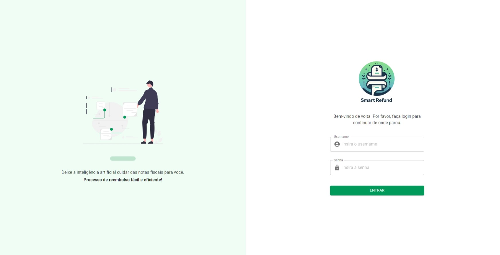
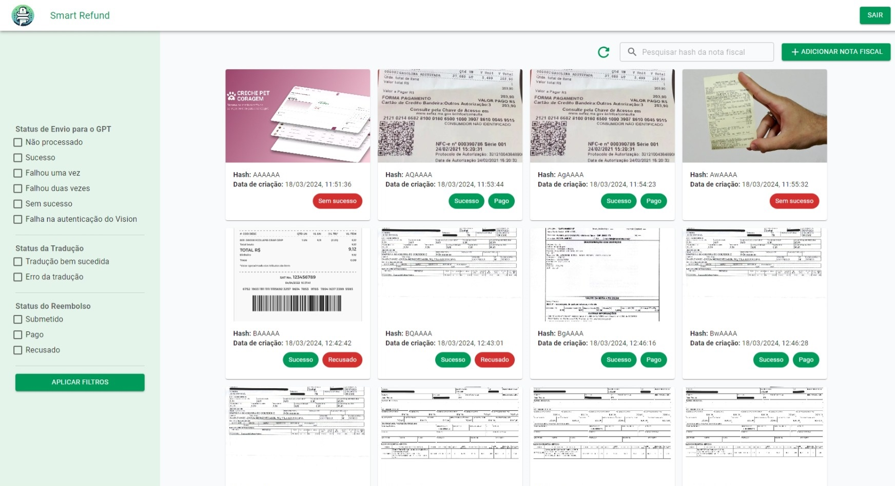
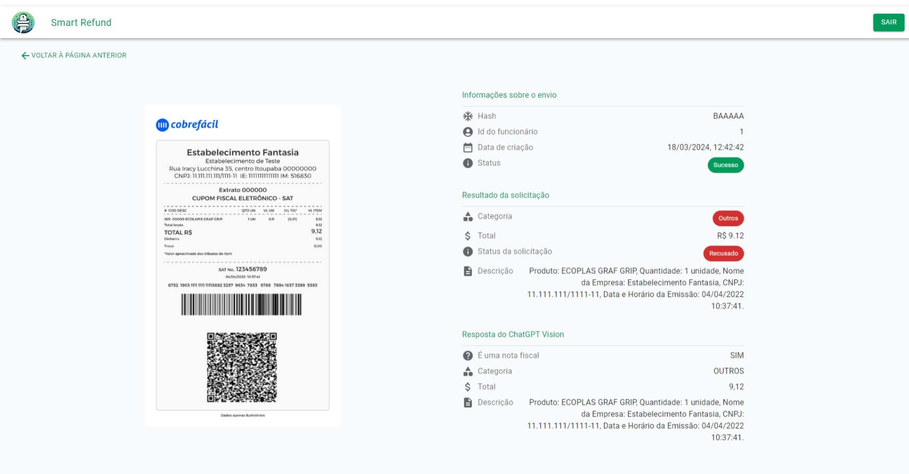

# Projeto SmartRefund 🤖💰

<div width="100%" align="center" style="display: flex; gap: 16px;">
<a href='https://nextjs.org/' target="_blank"></a>
<a href='https://mui.com/' target="_blank"></a>
<a href='https://axios-http.com/' target="_blank"></a>
<a href='https://react.dev/' target="_blank"></a>
<a href='https://tailwindcss.com/' target="_blank"></a>
</div>

SmartRefund é um sistema de reembolsos para empresas que permite o envio e análise de notas fiscais utilizando a tecnologia ChatGPT 4 Vision. Este repositório contém o código-fonte do frontend do projeto.

O frontend foi desenvolvido utilizando Next.js e está hospedado na plataforma Vercel. Você pode acessar a versão de produção do sistema [aqui](https://smart-refund-front.vercel.app/).

## Funcionalidades

- **Tela de Login:** Permite que os usuários acessem o sistema fornecendo seu username e senha.
- **Listagem de Notas Fiscais:** Apresenta uma lista de notas fiscais com opções de filtragem e barra de pesquisa.
- **Adicionar novas notas fiscais:** Apresenta um modal com a opção de enviar notas fiscais
- **Detalhes da Nota Fiscal:** Permite que os funcionários visualizem os detalhes das notas submetidas.
- **Modificar status das solicitações de reembolso**: Apresenta um modal com as opções `Submetido`, `Pago` e `Recusado`. Somente pessoas com acesso do financeiro conseguem realizar essas alterações.

<p align="center">
    
    
    
</p>

## Tecnologias Utilizadas

- [Next.js](https://nextjs.org/): Um framework React para renderização do lado do servidor.
- [React](https://react.dev/): Uma biblioteca JavaScript para construção de interfaces de usuário.
- [Axios](https://axios-http.com/): Um cliente HTTP baseado em Promises para fazer requisições.
- [Material-UI (Mui)](https://mui.com/): Uma biblioteca de componentes React para um design consistente e bonito.
- [Tailwind CSS](https://tailwindcss.com/): Um framework CSS utilitário para criar rapidamente designs personalizados.

## Como Executar o Projeto Localmente

1. Clone este repositório:

```bash
git clone https://github.com/armentanoc/SmartRefund.git
```

2. Configure o projeto `SmartRefund.Infra` como o projeto de inicialização no `Package Manager Console`.

3. Certifique-se de que as migrações do banco de dados foram realizadas pelo Entity Framework. Se não, execute os seguintes comandos:

```bash
Add-Migration CreateDatabaseInitial
Update-Database
```

4. Execute o projeto

5. Acesse o link do front: [Smart Refund](https://smart-refund-front.vercel.app/)

6. Na tela de login utilize um dos seguintes acessos:

```bash
Employee - Permite que submeta notas ficais para reembolso e verifique os status das notas enviadas.

{
  "userName": "employee1",
  "password": "employee123"
}

{
  "userName": "employee2",
  "password": "employee123"
}

Finance - Possibilita visualizar todas as notas fiscais submetidas e alterar o status delas para PAGA ou RECUSADA.

{
  "userName": "finance",
  "password": "finance123"
}
```

## Contribuições 🛠️

Aceitamos contribuições! Se encontrar um bug ou tiver uma solicitação de recurso, por favor, abra uma issue.

## Autores 📖

| [<br><sub>Laura de Faria</sub>](https://github.com/lauradefaria) | [<br><sub>Carolina Armentano</sub>](https://github.com/armentanoc) | [<br><sub>Camila Zambanini</sub>](https://github.com/czambanini) | [<br><sub>Paula Marinho</sub>](https://github.com/paulaandrezza) | [<br><sub>Igor Nunes</sub>](https://github.com/ig-nunes) | [<br><sub>Cristopher Saporiti</sub>](https://github.com/cristopherkovalski) |
| :-------------------------------------------------------------------------------------------------------------------------------------------------------: | :---------------------------------------------------------------------------------------------------------------------------------------------------------: | :-------------------------------------------------------------------------------------------------------------------------------------------------------: | :-------------------------------------------------------------------------------------------------------------------------------------------------------: | :----------------------------------------------------------------------------------------------------------------------------------------------------------------------------------------------------------------------------------------------------------------------: | :-----------------------------------------------------------------------------------------------------------------------------------------------------------------------------------------------------------------------------------------------------------------------------------------: |
